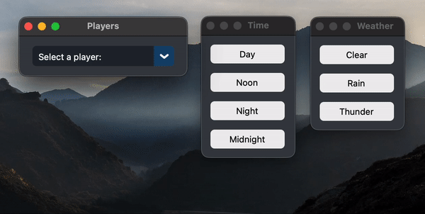
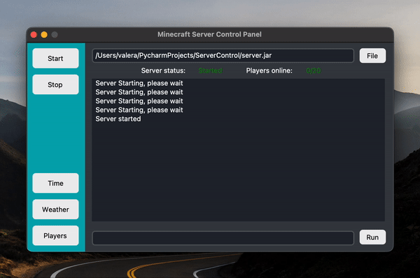
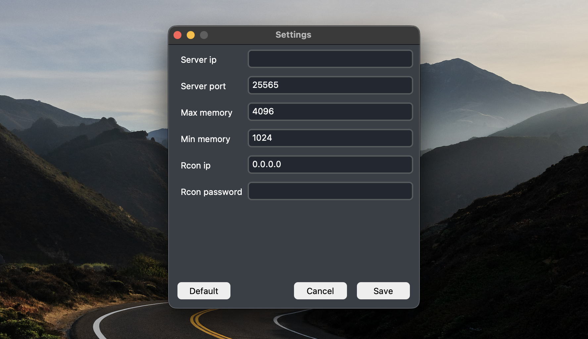
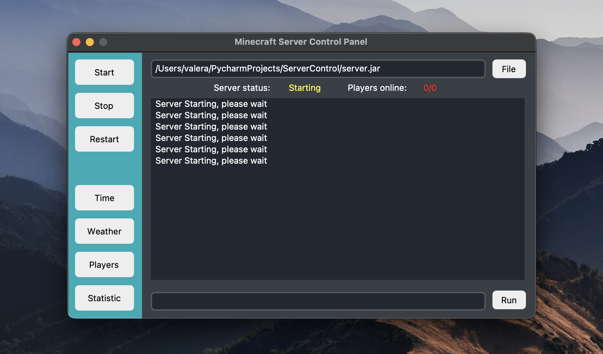

# Minecraft-Server-Control-Panel (Any server)
### Control panel for any minecraft server for Mac OS and Linux
<br />
_Main screen for control panel*_

# Control Panel Functions
<br />
_You can change the time, weather, and control the parameters of the player*_

---
<br />
_You can write commands to the server and get responses*_
# Installation

Download the latest release and extract it to your server folder

---
Install python3:
```
sudo apt-get install python3
sudo apt-get install python3-tk
```
---
Install pip:
>Run in a terminal in a directory with Control Panel 
```
python get-pip.py
```
or
```
sudo apt install python3-pip
```
---
Install pip library's:
```
pip install pyyaml
```
```
pip3 install customtkinter
```
```
pip install mcrcon
```
---
#### Enable rcon on server:
Remember to enable these options for the program to work [```server.properties```](https://minecraft.gamepedia.com/Server.properties) file.
```
enable-query=true
enable-rcon=true
query.port=25565
rcon.port=25575
rcon.password=your_pasword
```
# Usage
##### Run scrip
```
python3 main.py 
```
or
>Double click on start.sh
---
Go to the main tab and open the settings<br />
Fill in all the parameters for the panel to work correctly<br />


#### First start

Click on the file button in the upper right corner and select the jar file of your server which should be in the same folder as the control panel<br />

And press the start button

<br />
_Staring*_
---
<br />
_Started*_

### Done! You can use program 


